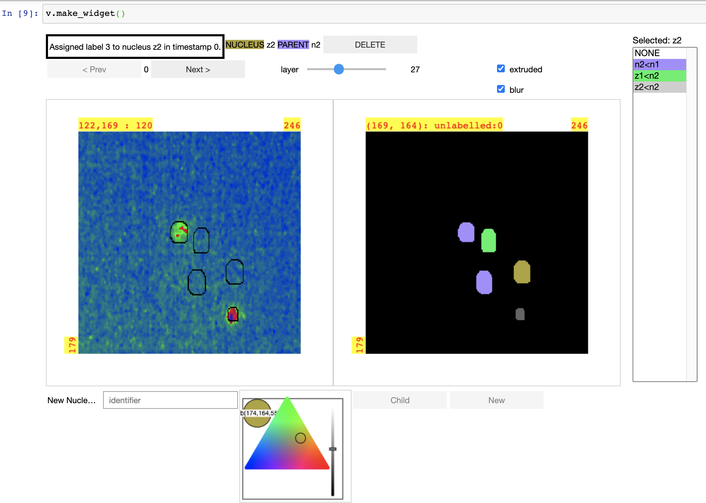

# mouse_embryo_labeller


This package includes tools for tracking mouse embryo cell nuclei over time using data derived from 4d microscopy.





## Installation

The following discussion describes how to install `mouse_embryo_labeller`
in a suitable Python 3 development environment with Jupyter installed.

If you need to get a Python
3 development environment, I recommend installing the
<a href="https://conda.io/projects/conda/en/latest/user-guide/install/index.html">The conda package system
(https://conda.io/projects/conda/en/latest/user-guide/install/index.html)
</a>
in single user mode (because it is easy to manage and remove if needed).

This experimental and evolving implementation uses the `jp_doodle` library extensively
and I have added features to `jp_doodle` to support this package.
Since it is likely that `jp_doodle` may grow more features to support
this repository, I recommend that you install jp_doodle in development mode
so it can be easily updated as needed.

Using the command line with the current working directory set to an appropriate folder:

```bash
% git clone https://github.com/AaronWatters/jp_doodle.git
% cd jp_doodle
% pip install -e .
% cd ..
```

Then clone and install `mouse_embryo_labeller` in the same folder also in development mode:

```bash
% git clone https://github.com/flatironinstitute/mouse_embryo_labeller.git
% cd mouse_embryo_labeller
% pip install -e .
% cd ..
```

Then you should be able to launch Jupyter and navigate to the test notebook
at `mouse_embryo_labeller/notebooks/tests/load test.ipynb`.  Run the cells of the notebook
and interact with the visualization to verify everything is working.

# Data preprocessing

The interactive widget reads `numpy` compressed array files and reads/writes JSON data files.

Please see `mouse_embryo_labeller.tools.preprocess_sample_data` for an example script
which reads sample source data files (`*.tiff` and `*.klb`)
downloaded from Google Drive and generates a folder containing
files which can be read and written by the widget.

Note that the sample script uses `pyklb` which is not listed as a dependancy for
`mouse_embryo_labeller` and which did not install cleanly on my Mac.
Try following the instructions in the sample script if you have trouble with `pyklb`:

```Python
    try:
        import pyklb
    except ImportError:
        print ("Please install pyklb or fix any install problems.")
        print ("Install problem fix at: https://github.com/bhoeckendorf/pyklb/issues/3")
        raise
```
