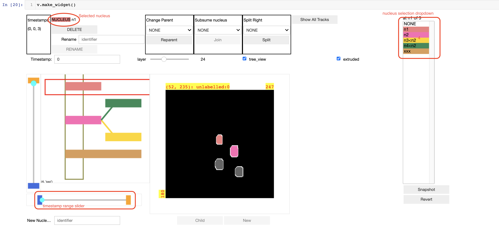

# Notes on using the nucleus tracker jupyter widget

These brief notes are based on a presentation given to the Postfai lab 11 August 2022.

## What is the tracker tool?

The tracker tool allows an analyst to view microscopy image data in combination with
labelled segmentation data which usually identifies cell nuclei shown in the microscopy image data.
The tracker can view many image volume pairs across many timestamps and the labelled segmentation
data can be organized into "tracks" representing the same nucleus over time, and the "tracks"
can be organized into tree structures showing cell ancestry relationships.

The tracker tool is a Jupyter widget.
It runs inside Jupyter notebooks.
It is implemented using Python 3.6+.

If you need to get Python and Jupyter I recommend
installing the Anaconda distribution in single user mode:
[The Anaconda distribution in single user mode](https://www.continuum.io/downloads).

The following image shows an example presentation of the tracker tools with some of
the interactive controls annotated for reference.



## Installation

Please follow the installation instructions in the README.

### KLB format support

If you need to preprocess KLB format files you may also need or want `pyklb` which
is not automatically installed.  Try

```
pip install pyklb
```

and then check that the install apparently worked using

```
python -c "import pyklb"
```

See the note in the README if the install didn't work.

# The example collections

To use the tracker widget you need to start Jupyter.  I use "classic notebook" started
from my top level home directory

```bash
~$ jupyter notebook
```

This should launch a file browser interface in your browser.

Navigate in the file browser interface to the following example notebooks:

## "Make a lineage tree" example notebook

```
.../mouse_embryo_labeller/notebooks/simple_example/make a lineage tree.ipynb
```

This notebook demonstrates how to load data into a timestamp collection
and how to create a nucleus collection including lineage parent information, and
how to view/modify the collections using the nucleus tracker tool.

The notebook uses the "low level applications programmer interface" that can
be used in higher level scripts to import data from any source into the tracker representation.

Use the File/Make a copy menu options to make a copy of this notebook you can
play with.

Things to try:

-- Execute the cells of the notebook and then snapshot the collections using the snapshot button.

-- Turn max intensity and extrusion on and off.

-- Turn the tree view on  and off

-- Click on the image and then use the arrow keys: UP goes up a layer; DOWN goes down a layer;
LEFT goes back in time; RIGHT goes forward in time.

-- Try using the layer slider to move up and down layers.

-- Use the Timestamp text input to jump to a  timestamp.

-- Make a new nucleus track: (a) Create a new nucleus with a new name at the bottom of the tracker.
(b) Click on an untracked label in each timestamp to identify the labels associated with the track.

3) Change the parent of n3 to n0 (instead of n2).

## The "view tracked" example notebook

```
.../mouse_embryo_labeller/notebooks/tests/view tracked.ipynb
```

This notebook loads a larger preprocessed data collection with many tracks but no
parentage information into the tracker tool.

Things to try in this notebook:

-- Take a snapshot so you can revert any mistakes.

-- Use the timestamp range slider to view only the early timestamps of the lineage tree view.

-- At timestamp 14 it looks like TR0 and TR10 are the same nucleus.  Subsume (merge) TR10 into TR0.

-- At timestamp 13 it looks like TR17 should be a child of TR15.  Change the parent of TR17 to TR15.

-- Merge TR9 into TR4.

-- Use the "show all tracks" button to return to viewing all timestamps and tracks in the tree view.
